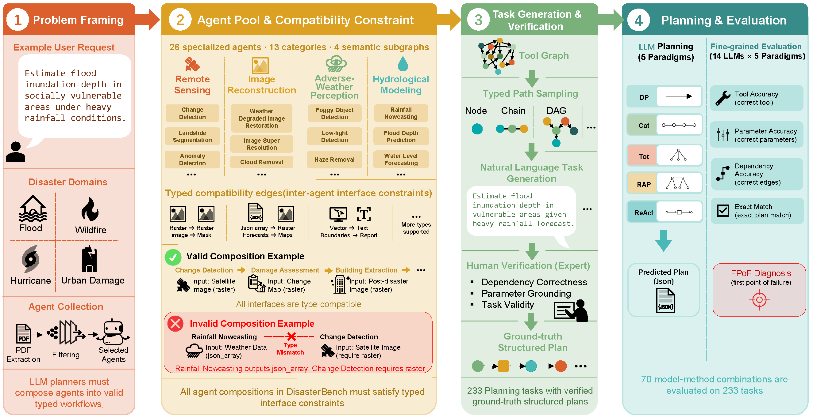

# 🧠 DisasterBench: Benchmarking LLM Planning in Disaster-Response Multi-Agent Systems

**DisasterBench** is a benchmark for evaluating whether LLMs can generate **executable structured workflows** in disaster-management scenarios.

Unlike conventional tool-use benchmarks, DisasterBench focuses on **workflow grounding under typed interface constraints**:
models must compose semantically similar but operationally distinct agents into valid multi-step plans with correct:

- agent selection
- parameter grounding
- dependency propagation

DisasterBench provides:

- **233 expert-verified planning tasks**
- **26 task-interface agents**
- **81 typed compatibility edges**
- **5 planning paradigms** (DP, CoT, ToT, RAP, ReAct)
- Fine-grained workflow diagnostics through **First-Point-of-Failure (FPoF)** analysis

---

## 🌍 Motivation

Disaster-response systems increasingly rely on heterogeneous AI capabilities such as:

- remote sensing
- change detection
- hydrological forecasting
- image restoration
- mobility prediction
- multimodal event understanding

As LLMs emerge as orchestrators of such systems, a key challenge arises:

> Can LLMs reliably compose specialized agents into executable workflows under interface compatibility constraints?

While existing benchmarks primarily evaluate tool selection or API invocation, real-world disaster workflows require preserving execution consistency across multiple dependent steps.

DisasterBench addresses this challenge through typed workflow planning tasks with executable ground-truth structured plans.

---

## 📚 Key Features

- **Typed Workflow Planning**  
  Agents are constrained by input/output interface compatibility rather than free-form composition.

- **Executable Structured Plans**  
  Ground-truth workflows include agents, parameters, and dependency structures.

- **Multi-Paradigm Planning Evaluation**  
  Supports Direct Planning, CoT, ToT, RAP (MCTS), and ReAct.

- **Fine-Grained Failure Diagnosis**  
  FPoF localizes the earliest structural failure in generated workflows.

- **Disaster-Response Agent Ecosystem**  
  Covers realistic disaster-management pipelines across sensing, forecasting, restoration, and analysis.

---

## 🧩 Benchmark Pipeline

<p align="center">

</p>

*Figure: Overview of the DisasterBench construction and evaluation pipeline. The benchmark integrates typed agent composition, workflow verification, structured planning, and fine-grained execution evaluation.*

---

## ⚙️ Benchmark Overview

DisasterBench contains:

| Component | Statistics |
|---|---|
| Planning Tasks | 233 |
| Task-Interface Agents | 26 |
| Functional Categories | 13 |
| Compatibility Edges | 81 |
| Workflow Structures | Node / Chain / DAG |
| Planning Paradigms | 5 |
| Evaluation Metrics | 5 |

---

## 🚀 Quick Start

### 1️⃣ Installation

```bash
git clone https://github.com/your_repo/DisasterBench.git
cd DisasterBench

pip install -r requirements.txt
export PYTHONPATH=.
```

Set API key:

```bash
export OPENROUTER_API_KEY=...
# or
export OPENAI_API_KEY=...
```

---

### 2️⃣ Run Chain-of-Thought Planning

```bash
python3 baselines/test_baseline.py \
  --test_type cot \
  --api openrouter \
  --model_ckpt deepseek/deepseek-v3.2 \
  --data_root data \
  --train_test_json_data benchmark.jsonl \
  --task_num 0 \
  --max_threads 12 \
  --max_tokens 8192 \
  --num_chain_of_thought 16 \
  --use_fewshot True
```

- `--task_num 0` runs the full benchmark
- `--task_num N` runs a single task

Outputs are saved to:

```text
results/<model>/<method>/
```

---

## 🧠 Supported Planning Paradigms

| Method | Flag |
|---|---|
| Direct Planning | `--test_type dp` |
| Chain-of-Thought | `--test_type cot` |
| Tree-of-Thought | `--test_type tot` |
| RAP (MCTS) | `--test_type rap` |
| ReAct | `--test_type react` |

---

## 🏗️ Structural Baselines (No LLM)

Run graph-based structural baselines:

```bash
PYTHONPATH=. python3 scripts/run_structural_baselines.py \
  --baseline shortest_path
```

Additional baselines:

- `oracle_random`
- `dag_greedy_tfidf`
- `dag_beam_tfidf`

---

## 📂 Repository Structure

```text
DisasterBench/
├── assets/
├── baselines/
├── config/
├── data/
├── docs/
├── evaluators/
├── interfaces/
├── scripts/
├── utils/
├── README.md
├── requirements.txt
└── LICENSE
```

---

## 📊 Evaluation Metrics

| Metric | Meaning |
|---|---|
| **Overall** | Exact structured-plan match |
| **Tools** | Correct tool selection |
| **Parameters** | Correct parameter grounding |
| **Dependencies** | Correct dependency structure |
| **FPoF** | Earliest workflow failure category |

---

## 📜 Citation

```bibtex
@misc{disasterbench2026,
  title={DisasterBench: Benchmarking LLM Planning under Typed Tool Interface Constraints},
  author  = {Anonymous Authors},
  year=  {2026},
  note    = {Under Review}
}
```

---
---

## 🙌 Acknowledgments

This benchmark was developed by an academic research team in collaboration with disaster resilience and information retrieval experts. We thank all annotators for their rigorous contributions.

---


## 📄 License

Released under the MIT License.
